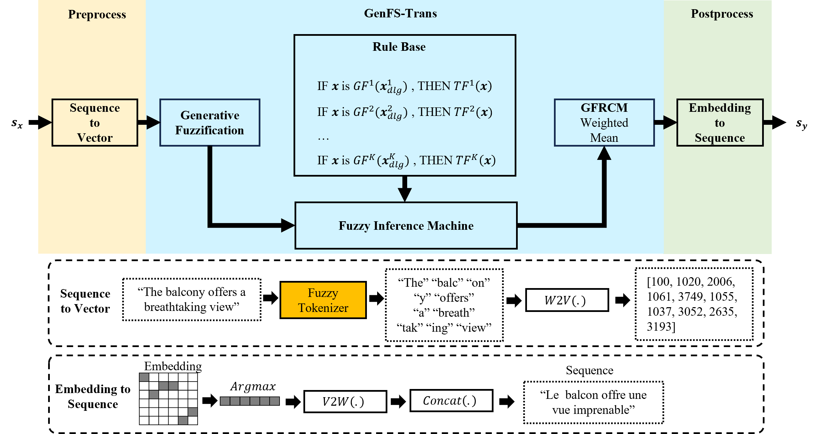

<p align="center">

</p>
<h1 align="center">
Generative Fuzzy System for Sequence-to-Sequence Learning
</h1>
<p align="center">


</p>


We proposed a novel framework (**Generative Fuzzy System**, **GenFS**) combining fuzzy systems and generative models, with the target of processing multimodal data generation.

<p align="center">
 <br>
Figure 1. Generative Fuzzy System (GenFS)
</p>

**A series of works based on GenFS:**
- [x] FuzzyS2S (**text** generation), *Generative Fuzzy System for Sequence-to-Sequence Learning* (revise and resubmit).
- [x] FuzzyDiffusion (**image** generation), *Generative Fuzzy Rule Guided Latent Space Multi-Path Diffusion Model* (under submission).
- [ ] FuzzyMusic (**audio** generation).
- [ ] FuzzyAgents (**multimodal** generation includeing text, image, audio).


## FuzzyS2S
FuzzyS2S is an end-to-end GenFS-based model for sequence-to-sequence learning.
<p align="center">
 <br>
Figure 2. Structure of FuzzyS2S, TF<sub>k</sub> is the Transformer processing unit of the kth rule consequent, s<sub>x</sub> is the input sequence, and s<sub>y</sub> is the target sequence. the Preprocess module named Sequence to Vector is to implement the conversion from sequences to word vectors, and the Postprocess module named Embedding to Sequence is to convert the decoded word embeddings into the target sequences.
</p>


we propose a specific multi-scale tokenizer, called fuzzy tokenizer. The fuzzy tokenizer is a fuzzy system based on multi-scale sub-word tokenizers that enables the adaptive slicing of words at different scales.

## Datasets

The datasets include three categories: machine translation, summary generation, and code generation, totaling 12 datasets. The datasets for machine translation are WMT14, Tatoeba, EUconst and Ubuntu. The datasets for summary generation are CNN/DM (CNN Daily Mail), SAMSum, XLSum and BillSum. The datasets for code generation are HS (HearthStone), MTG (Magic the Game), GEO (Geoquery) and Spider. 

### (1) Machine Translation Datasets

**[WMT14](https://huggingface.co/datasets/wmt/wmt14)**: This dataset is the most commonly used dataset internationally in the field of neural machine translation. It is a collection of datasets used for the shared tasks of the 9th 2014 Workshop on Statistical Machine Translation (WMT). The dataset includes English-German, German-English, English-French, French-English, English-Hindi, Hindi-English, English-Czech, Czech, English-English, English-Russian, Russian, and Russian-English. English-Czech, Czech-English, English-Russian, and Russian-English language pairs. In this paper, the English-French language pair is chosen to evaluate the model’s capability. 

**[Tatoeba](https://huggingface.co/Helsinki-NLP/opus-tatoeba-en-tr)**: This dataset originates from the Tatoeba project, which is a dataset of multilingual translations, containing 397 languages and 4,344 bilingual texts. The Tatoeba project was founded by Trang Ho in 2006 to maintain a massive database of sentences and translations. In this paper, the English-French language pairs (2023) were selected to evaluate the modelling capabilities. 

**[EUconst](https://huggingface.co/datasets/Helsinki-NLP/euconst)**: this dataset is collected from the parallel corpus of the European Constitution (EC) and contains 210 bilingual texts in 21 languages. 

**[Ubuntu](https://huggingface.co/datasets/Helsinki-NLP/opus_ubuntu)**: This dataset consists of translations of system package information donated by the Ubuntu community in 244 languages and contains 23,988 pairs of bilingual corpus texts. In this paper, a subset of Bosnian-Assamese (bs-as) language pairs is used. Since the selected languages are relatively niche, they can be used to evaluate the model's ability to learn particular grammatical sequences. 

### (2) Summary Generation Datasets

**[CNN/DM](https://huggingface.co/datasets/abisee/cnn_dailymail)** (CNN Daily Mail): This dataset is an English corpus dataset containing more than 300,000 unique news articles written by CNN and Daily Mail journalists. The current version supports both extracted and abstracted summaries. The original version was created for machine reading and comprehension and abstracted Q&A. This dataset is a very important benchmarking dataset in the field of summary generation. 

**[SAMSum](https://huggingface.co/datasets/Samsung/samsum)**: This dataset contains approximately 16,000 sets of dialogues with summaries created and recorded by linguists fluent in English. In this dataset, the style and register of the dialogues are diverse, containing informal, semi-formal or formal dialogues. In addition, the dialogues contain slang, emoticons and spelling mistakes. 

**[XLSum](https://huggingface.co/datasets/GEM/xlsum)**: This highly multilingual aggregated dataset supports 44 languages, with data derived from BBC news reports. The Franch subset is used in this paper. 

**[BillSum](https://huggingface.co/datasets/FiscalNote/billsum)**: This dataset was collected from US Congressional and California Bill Summaries and specifically consists of three parts: the US Training Bill, the US Testing Bill, and the California Testing Bill. It focuses on medium-length legislation between 5,000 and 20,000 characters in length. 

### (3) Code Generation Datasets

**[HS](https://huggingface.co/datasets/dvitel/hearthstone)** (HearthStone) : This dataset is a code generating dataset collected from a card game simulator, with inputs consisting of a mixture of natural language and partially structured data, and outputs in python code. The dataset serves as a benchmark test generated from current research code. 

**MTG** (Magic the Game): This dataset is a code generation dataset collected from a card game engine, where the input is a mixture of natural language and partially structured data, and the output is java code. It is also a benchmarking dataset for studying code generation.

**[GEO](https://huggingface.co/datasets/DARELab/geoquery)** (Geoquery): This dataset is a standard semantic parsing benchmark test dataset containing 704 samples, which generates target code in the logical language SQL, thus evaluating the model's logical code generation capabilities.

**[Spider](https://huggingface.co/datasets/xlangai/spider)**: This dataset is a large, complex cross-domain semantic parsing text-to-SQL dataset annotated by 11 Yale students. It is an important benchmarking dataset for evaluating semantic parsing capabilities, containing 10,181 questions and 5,693 unique complex SQL queries across 200 databases. 

## Conda Enviroment Setup

``` shell
conda create --name fuzzys2s --file ./requirements.txt
conda activate fuzzys2s
```

## Train
### step1. setting
set base_path int setting.py
``` python
options.base_path="/home/xxxx/fuzzys2s/"
```
### step2. download datasets
start downloading datasets from remote dataset hubs.
``` shell
cd src
python3 loaddata.py
```
log output:
``` log
2025-04-23 16:45:05.232 | INFO     | __main__:download_dataset:181 - wmt14 - fr-en done
2025-04-23 16:45:05.319 | INFO     | __main__:download_dataset:181 - spider -  done
2025-04-23 16:45:05.323 | INFO     | __main__:download_dataset:181 - dvitel/geo -  done
2025-04-23 16:45:05.326 | INFO     | __main__:download_dataset:181 - opus_euconst - en-fr done
2025-04-23 16:45:05.340 | INFO     | __main__:download_dataset:181 - cnn_dailymail - 1.0.0 done
2025-04-23 16:45:05.349 | INFO     | __main__:download_dataset:181 - samsum -  done
2025-04-23 16:45:05.358 | INFO     | __main__:download_dataset:181 - GEM/xlsum - french done
2025-04-23 16:45:05.368 | INFO     | __main__:download_dataset:181 - xsum -  done
...
```
### step3. training fuzzy tokenizer
start training fuzzy tokenizer
```shell
python3 fuzzy_tokenizer.py
```
log output:
```log
2025-04-23 17:10:00.762 | INFO     | __main__:train_fuzzy_tokenizer:147 - multi-scale Tokenizer, vocab size 100000 , tokenizer found
2025-04-23 17:10:00.762 | INFO     | __main__:train_fuzzy_tokenizer:150 - fuzzy_vs100000_tokenizer train start...
2025-04-23 17:10:00.762 | INFO     | __main__:train_tokenizer_on_dataset:118 - train tokenizer on ubuntu, vocab size 100000
2025-04-23 17:10:00.762 | INFO     | loaddata:read_ubuntu_data:286 - read ubuntu data
read data: 8384it [00:00, 49627.91it/s]
2025-04-23 17:10:00.972 | INFO     | loaddata:read_ubuntu_data:305 - dataset: ubuntu, train: 6708, valid: 838, test: 838
2025-04-23 17:10:01.320 | INFO     | __main__:train_tokenizer_on_dataset:118 - train tokenizer on opus_euconst, vocab size 100000
2025-04-23 17:10:01.320 | INFO     | loaddata:read_opus_euconst_data:501 - read opus_euconst data
2025-04-23 17:10:01.327 | INFO     | loaddata:read_dataset:193 - opus_euconst-en-fr done
2025-04-23 17:10:01.327 | INFO     | loaddata:read_opus_euconst_data:503 - read raw tokens
2025-04-23 17:10:01.328 | INFO     | loaddata:read_opus_euconst_data:507 - dataset:opus_euconst, total: 10104
```

### step4. training fuzzys2s model

```shell
python3 run.py
```

log output:
``` log
2025-04-24 00:33:21.777 | INFO     | run:s2s_task:490 - model fuzzys2s on dataset wmt14 start...
[W Context.cpp:70] Warning: torch.use_deterministic_algorithms is in beta, and its design and functionality may change in the future. (function operator())
2025-04-24 00:33:21.778 | INFO     | run:setup_seed:38 - seed: 10, random:0.5714, torch random:0.4581, np random:0.7713
2025-04-24 00:33:21.778 | INFO     | loaddata:read_wmt14_data:255 - read wmt14 data
Loading dataset from disk: 100%| | 30/30 [00:00<00:00, 257.21it/s]
2025-04-24 00:33:22.047 | INFO     | loaddata:read_dataset:193 - wmt14-fr-en done
2025-04-24 00:33:22.047 | INFO     | loaddata:read_wmt14_data:259 - read raw tokens
read train data: 100%|█████████████| 500000/500000 [00:26<00:00, 18579.35it/s]
2025-04-24 00:33:49.236 | INFO     | loaddata:read_wmt14_data:261 - dataset: wmt14, train: 500000
2025-04-24 00:33:49.288 | INFO     | loaddata:gen_feature_data:211 - build vocabulary
2025-04-24 00:34:09.155 | INFO     | loaddata:gen_feature_data:217 - src vocab name:src en, size:68954
2025-04-24 00:34:09.155 | INFO     | loaddata:gen_feature_data:218 - tgt vocab name:tgt fr, size:89270
2025-04-24 00:34:09.155 | INFO     | loaddata:gen_feature_data:219 - generate token vectors
token vector: 100%|█████████████| 500000/500000 [00:05<00:00, 93147.77it/s]
2025-04-24 00:34:15.717 | INFO     | run:check_fcm_info:213 - find wmt14 fcm info
2025-04-24 00:34:15.718 | INFO     | run:load_fcm_info:257 - load wmt14 fcm info
2025-04-24 00:34:16.617 | INFO     | run:loadmodel:175 - load transformer-wmt14 model parameters done
2025-04-24 00:34:57.899 | INFO     | run:model_info:41 - [model fuzzys2s]
2025-04-24 00:34:57.899 | INFO     | run:model_info:42 - rule_num: 3, embedding: 512, h: 10.0, drop_out: 0.1, learning_rate: 0.0001
2025-04-24 00:34:57.901 | INFO     | run:model_info:45 - total parameters: 137067446, trainable  parameters: 137067446 
train data:   0%|        | 28/500000 [00:26<132:14:31,  1.05it/s]
```
default dataset is wmt14, you can add datasets into `datasets` array in run.py as follow:
``` python
if __name__ == '__main__':
    # datasets =['opus_euconst', 'tatoeba','wmt14', 'ubuntu']
    # datasets =['hearthstone', 'magic', 'geo',  'spider']
    # datasets =['cnn_dailymail', 'samsum',  'billsum', 'xlsum']
    run(pretrain_used=False, datasets= ['wmt14']):
    print("done")
```

## Test
``` shell
python3 test.py
```
log output:
``` log
2025-04-24 00:36:58.327 | INFO     | run:model_info:41 - [model fuzzys2s]
2025-04-24 00:36:58.327 | INFO     | run:model_info:42 - rule_num: 3, embedding: 512, h: 10.0, drop_out: 0.1, learning_rate: 0.0001
2025-04-24 00:36:58.330 | INFO     | run:model_info:45 - total parameters: 137067446, trainable  parameters: 137067446 
test data:   1%█▏          | 23/3003 [00:29<49:09,  1.01it/s]
```
If you want some pre-trained models of fuzzys2s, feel free to email me.

